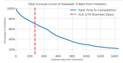

# About Me

## Education
* M.S. Analyics - Georgia Tech (2024)
* B.S. Business Information Technology - Virginia Tech (2009)

## Experience
* Department of Health and Human Services / U.S. Food and Drug Administration
* Department of Homeland Security / U.S. Immigration and Customs Enforcement
* Citigroup
* Deloitte

* * *

# Portfolio

This a collection of projects / analyses:

## DC Sidewalk Anaylsis (2022)

An analysis into missed service targets for sidewalk repairs spurred by persistently closed tickets without resolution.
[Git](https://github.com/bharatbk/dc_sidewalk_analysis/blob/main/Increasing%20Resources%20for%20Sidewalk%20Repair%20Public.ipynb)

